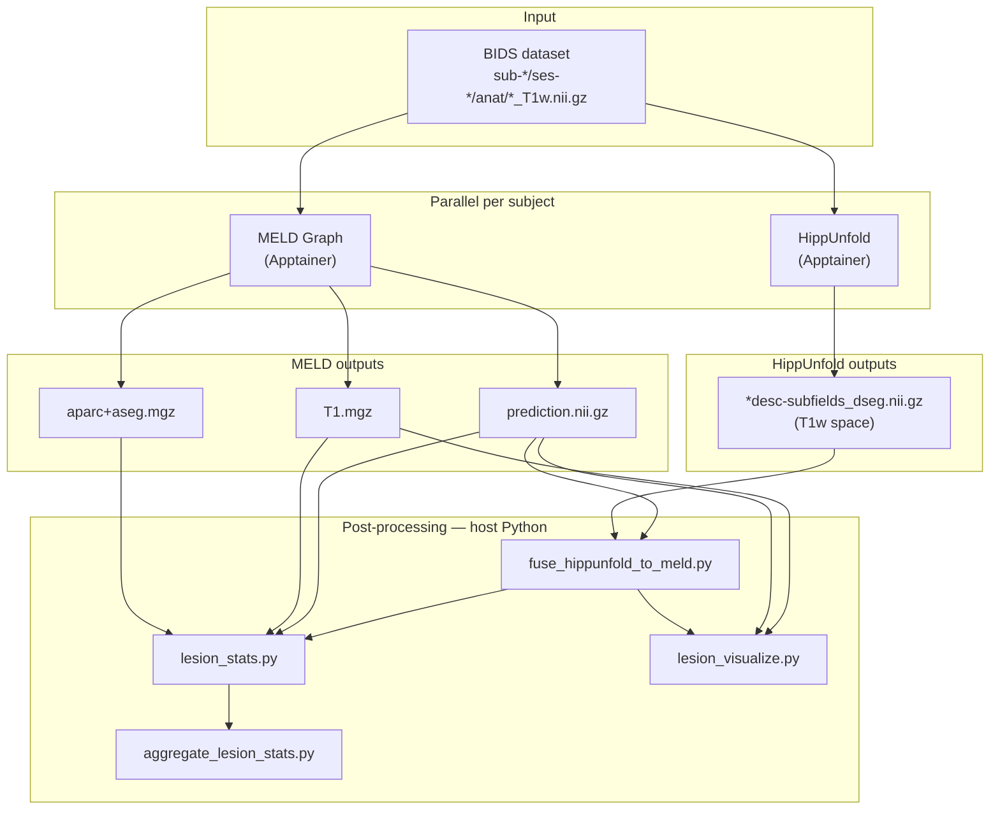
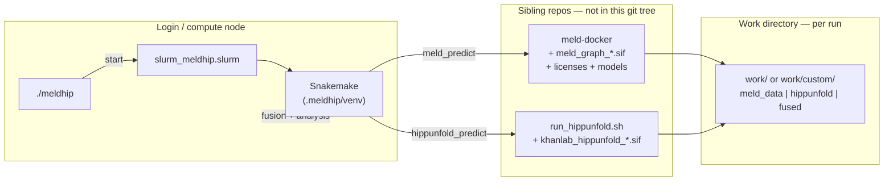
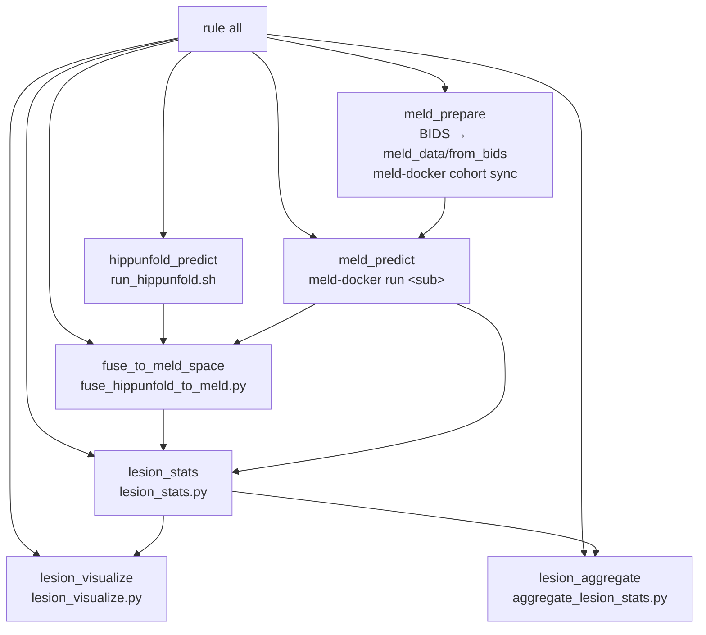
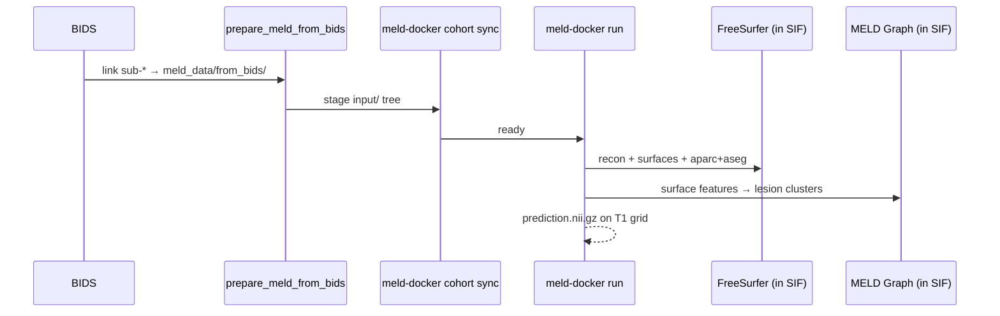
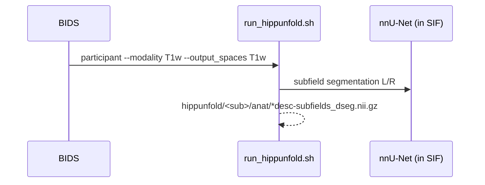
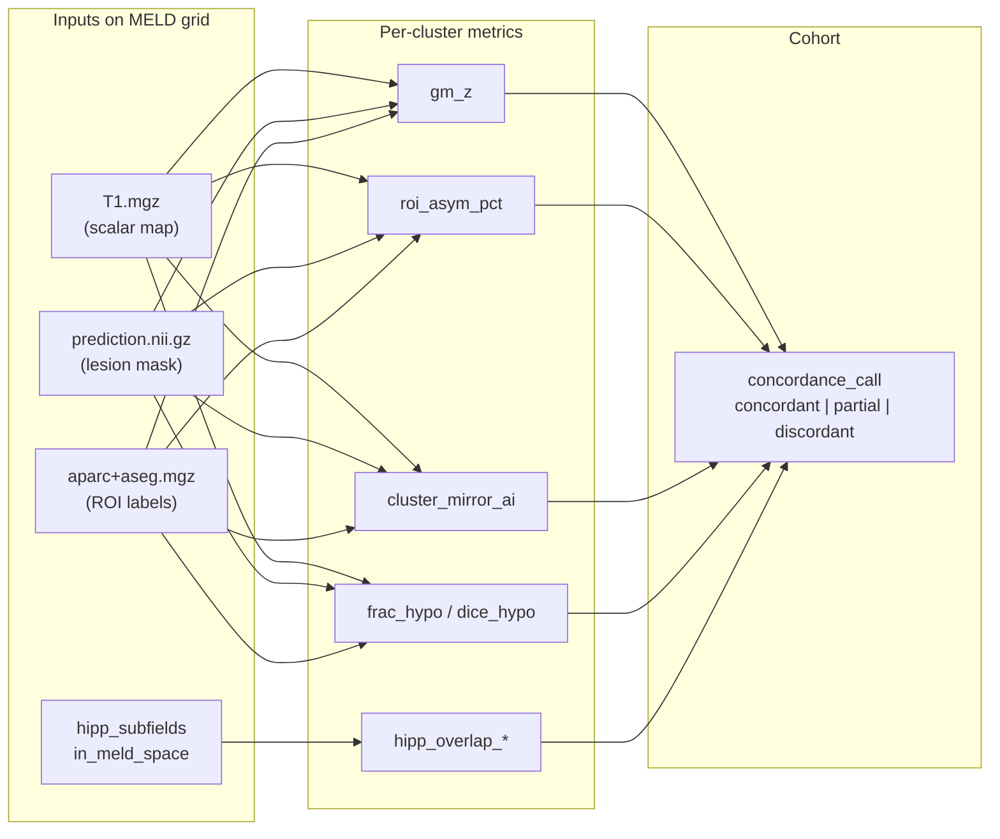

# Meld_Hippunfold — full pipeline reference

End-to-end documentation for the **Meld_Hippunfold** Snakemake pipeline: MELD Graph FCD lesion prediction, HippUnfold hippocampal subfield segmentation, native-T1 fusion, and MELD_CBF-style lesion asymmetry / concordance analysis on structural T1.

For a short quick start see [README.md](README.md). For CLI, config, and troubleshooting see [USER_GUIDE.md](USER_GUIDE.md).

---

## 1. What the pipeline does

Given a **BIDS** dataset with T1w per subject, Meld_Hippunfold:

1. Runs **MELD Graph** (FreeSurfer recon + graph neural network) → cortical FCD lesion map.
2. Runs **HippUnfold** (nnU-Net subfield segmentation) → hippocampal subfield labels in native T1w space.
3. **Fuses** HippUnfold subfields onto the MELD `prediction.nii.gz` voxel grid.
4. Computes **lesion statistics** (ROI asymmetry, mirror asymmetry, GM z-scores, hipp overlap) and a cohort **concordance call**.

MELD and HippUnfold are **independent** container runs on the same BIDS input. Fusion is a lightweight resampling step — there is no joint registration product from upstream tools.



---

## 2. System architecture

The pipeline **orchestrates** existing lab container deployments; it does not rebuild MELD or HippUnfold images.



| Layer | Component | Role |
|-------|-----------|------|
| CLI | `./meldhip` | `install`, `check`, `start`, `logs` |
| Scheduler | SLURM + `slurm_meldhip.slurm` | Single job runs full Snakemake DAG |
| Orchestration | Snakemake `workflow/Snakefile` | DAG, resume, resource limits |
| MELD | `meld-docker` in Apptainer SIF | FreeSurfer + MELD Graph GNN |
| HippUnfold | `run_hippunfold.sh` + SIF | BIDS App, nnU-Net subfields |
| Host Python | venv | Fusion, stats, viz, aggregate |

Site paths are set in `production.env` (gitignored). Runtime paths are written to `.meldhip/run_config.env` on each `./meldhip start`.

---

## 3. Snakemake DAG (all rules)

Per-subject rules run in parallel where dependencies allow. `meld_prepare` runs once per cohort; `lesion_aggregate` runs once at the end.



ASCII equivalent (dependency-only):

```
                    ┌─────────────────┐
                    │   meld_prepare  │
                    └────────┬────────┘
                             │
         ┌───────────────────┼───────────────────┐
         │                   │                   │
         ▼                   │                   ▼
┌─────────────────┐         │        ┌──────────────────────┐
│  meld_predict   │         │        │ hippunfold_predict   │
│  (per subject)  │         │        │   (per subject)      │
└────────┬────────┘         │        └──────────┬───────────┘
         │                   │                   │
         └─────────┬─────────┘                   │
                   ▼                             │
         ┌─────────────────┐                   │
         │ fuse_to_meld_   │◄──────────────────┘
         │     space       │
         └────────┬────────┘
                  │
         ┌────────┴────────┐
         ▼                 ▼
┌─────────────────┐  ┌─────────────────┐
│  lesion_stats   │  │lesion_visualize │  (optional)
└────────┬────────┘  └─────────────────┘
         │
         ▼
┌─────────────────┐
│lesion_aggregate │  (once per cohort)
└─────────────────┘
```

### Rule summary

| Rule | Container / runtime | Primary outputs |
|------|---------------------|-----------------|
| `meld_prepare` | bash + `meld-docker cohort sync` | `meld_data/.cohort_synced` |
| `meld_predict` | MELD Apptainer | `prediction.nii.gz`, `T1.mgz`, `aparc+aseg.mgz` |
| `hippunfold_predict` | HippUnfold Apptainer | `hippunfold/<sub>/anat/*subfields_dseg*` |
| `fuse_to_meld_space` | host Python (nibabel) | `fused/<sub>/hipp_subfields_in_meld_space.nii.gz` |
| `lesion_stats` | host Python | `analysis/<sub>/lesion_in_clusters_<sub>.csv` |
| `lesion_visualize` | host Python (nilearn) | `analysis/<sub>/figures/*.png` |
| `lesion_aggregate` | host Python (pandas) | `output/cohort_lesion_stats.csv` |

**Resource limits** (Snakemake `--resources`): `heavy_fs=1` caps concurrent MELD jobs; `hippunfold=2` caps concurrent HippUnfold jobs.

---

## 4. Per-subject data flow

### 4.1 MELD branch



MELD writes `prediction.nii.gz` in **FreeSurfer conformed T1 space** — same geometry as `output/fs_outputs/<sub>/mri/T1.mgz`. All downstream MELD-grid analysis uses this grid.

### 4.2 HippUnfold branch



HippUnfold must run with `--output_spaces T1w` so subfield segmentations are in native T1w space (required for fusion).

### 4.3 Fusion — why and how

MELD and HippUnfold never register to each other. Fusion resamples HippUnfold labels **onto the MELD prediction grid**:

```
  HippUnfold T1w grid                    MELD prediction grid
  ┌──────────────────┐                   ┌──────────────────┐
  │ CA1  DG  subiculum│  resample_from_to │ prediction labels │
  │  (native T1w)     │  ───────────────► │  + hipp subfields │
  └──────────────────┘      order=0       └──────────────────┘
         ▲                                        ▲
         │                                        │
    HippUnfold                              MELD Graph
    subfields_dseg                          prediction.nii.gz
```

Script: `workflow/scripts/fuse_hippunfold_to_meld.py`

- Finds `*space-T1w*desc-subfields_dseg.nii.gz` (both hemispheres).
- Combines hemi labels with per-voxel `maximum`.
- Resamples to MELD `prediction.nii.gz` with nearest neighbour (`order=0`).
- Writes `fusion_manifest.json` with provenance.

---

## 5. Lesion analysis branch

Ported from [MELD_CBF](../Meld_CBF/pipeline). **No CBF perfusion map** — the scalar map is MELD `T1.mgz` (already on the prediction grid; no extra registration).



### Concordance logic (same thresholds as MELD_CBF)

```
hypoperfused       = roi_asym_pct <= asym_concordance_pct   (default −8%)
spatial_concordant = dice_hypo    >= dice_concordance        (default 0.10)

concordance_call   = concordant   if both true
                   = partial     if either true
                   = discordant  otherwise
```

With T1 as the scalar map, `hypoperfused` / `frac_hypo` / `dice_hypo` index **structural** GM deviation, not perfusion. Column names match MELD_CBF for tooling compatibility.

---

## 6. Directory layout

Example after `./meldhip start -i <bids> -w work/mycohort -p sub-001 sub-002`:

```
Meld_Hippunfold/
├── meldhip                          CLI entrypoint
├── production.env                   site paths (local, gitignored)
├── .meldhip/
│   ├── run_config.env               last start parameters
│   ├── last_job_id                  SLURM job id
│   └── venv/                        Snakemake + analysis Python
├── config/config.yaml
├── slurm_meldhip.slurm
└── work/mycohort/
    ├── meld_data/
    │   ├── from_bids/sub-001/ …     symlinks to BIDS
    │   ├── input/sub-001/ …         meld-docker staging
    │   ├── models/  meld_params/    seeded from deploy bundle
    │   └── output/
    │       ├── fs_outputs/sub-001/mri/
    │       │   ├── T1.mgz
    │       │   └── aparc+aseg.mgz
    │       ├── predictions_reports/sub-001/predictions/
    │       │   └── prediction.nii.gz
    │       ├── analysis/sub-001/
    │       │   ├── lesion_in_clusters_sub-001.csv
    │       │   └── figures/*.png
    │       └── cohort_lesion_stats.csv
    ├── hippunfold/sub-001/anat/
    │   └── *desc-subfields_dseg.nii.gz
    └── fused/sub-001/
        ├── hipp_subfields_in_meld_space.nii.gz
        └── fusion_manifest.json
```

---

## 7. Inputs and outputs

### Inputs

| Requirement | Location / notes |
|-------------|------------------|
| BIDS T1w | `sub-*/ses-*/anat/*_T1w.nii.gz` |
| MELD SIF + licenses | `MELD_DEPLOY_ROOT` (see `production.env`) |
| MELD models + params | `meld_data/models`, `meld_data/meld_params` (auto-seeded) |
| HippUnfold SIF | `HIPPUNFOLD_SIF` or `../HippUnfold/*.sif` |
| Subject filter | `-p sub-001 sub-002` or all `sub-*` in BIDS |

### Final targets (`rule all`)

| Output | Description |
|--------|-------------|
| `fused/<sub>/hipp_subfields_in_meld_space.nii.gz` | Subfields on MELD grid |
| `analysis/<sub>/lesion_in_clusters_<sub>.csv` | Per-lesion statistics |
| `output/cohort_lesion_stats.csv` | Cohort table + concordance |
| `analysis/<sub>/figures/*.png` | Overlays (if `enable_analysis_viz: true`) |

---

## 8. Running the pipeline

```bash
# One-time setup
cp production.env.example production.env   # edit paths
./meldhip install
./meldhip check

# Full cohort
./meldhip start -i /path/to/bids

# Named subjects + separate work tree
./meldhip start -i /path/to/bids \
  -w work/mycohort \
  -p sub-001 sub-002

# Plan without submitting
./meldhip start -i /path/to/bids --dry-run

# Monitor
squeue -j <jobid>
./meldhip logs -f
```

### SLURM job sketch

```
  login node                         compute node
 ┌─────────────┐                    ┌─────────────────────────────┐
 │ ./meldhip   │  sbatch          │ slurm_meldhip.slurm         │
 │   start     │ ───────────────► │  → activate venv            │
 └─────────────┘                  │  → snakemake -s Snakefile   │
                                  │     (48h, 8 CPU, 64G)       │
                                  └─────────────────────────────┘
```

Default `#SBATCH`: 48 h, 8 CPUs, 64 G RAM — edit `slurm_meldhip.slurm` for your partition/account.

**Runtime expectation:** `meld_predict` dominates (FreeSurfer + GNN, often **hours per subject**). HippUnfold, fusion, and analysis are shorter.

---

## 9. Configuration sketch

```
config/config.yaml          ← defaults (thresholds, resource limits)
        +
production.env              ← site paths (MELD_DEPLOY_ROOT, SIF overrides)
        +
./meldhip start -i … -p …   ← BIDS, work_dir, subject filter
        +
.meldhip/run_config.env     ← written at start, read by SLURM job
        +
slurm_meldhip.slurm --config  ← passes bids_dir, subjects[], flags into Snakemake
```

Key analysis keys in `config/config.yaml`:

| Key | Default | Purpose |
|-----|---------|---------|
| `hypo_z` | `-1.5` | GM z threshold for `frac_hypo` / `dice_hypo` |
| `asym_concordance_pct` | `-8.0` | ROI asymmetry cutoff (%) |
| `dice_concordance` | `0.10` | Spatial overlap cutoff |
| `enable_analysis_viz` | `true` | PNG overlays |

---

## 10. Repository map

```
workflow/
├── Snakefile                         full DAG
├── scripts/
│   ├── prepare_meld_from_bids.sh     BIDS → meld_data cohort links
│   ├── fuse_hippunfold_to_meld.py    HippUnfold → MELD grid
│   └── aggregate_lesion_stats.py     cohort CSV + concordance
└── analysis/
    ├── lesion_stats.py               per-subject CSV (MELD_CBF port)
    └── lesion_visualize.py           T1 / lesion / subfield PNGs
```

---

## 11. Related documentation

| Document | Contents |
|----------|----------|
| [README.md](README.md) | Quick start, outputs, citations |
| [USER_GUIDE.md](USER_GUIDE.md) | CLI, config tables, formulas, troubleshooting |
| [meld.md](meld.md) | MELD Graph container + `meld-docker` |
| [hip.md](hip.md) | HippUnfold container + `run_hippunfold.sh` |

---

## 12. Citations

See [README.md — Citations](README.md#citations) for MELD Graph, HippUnfold, FreeSurfer, BIDS, Snakemake, and related papers.
